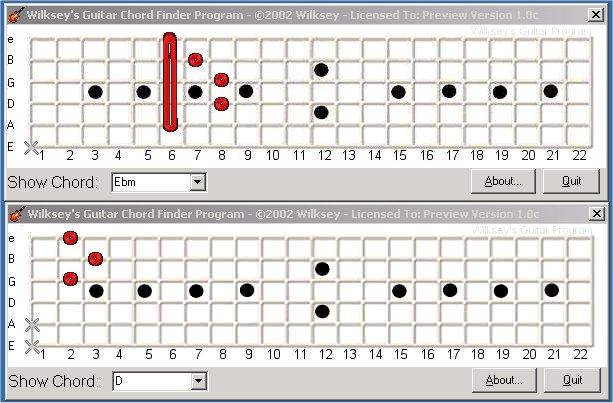



## GUITAR CHORD PROGRAM 1\.0c UPDATED\!\!\!

### Description

This is a MINOR update to my previous submission(s), It now includes:

SUPPORT UP TO THE 12TH FRET!!  MORE CHORDS!!! OPEN AND NOT PLAYED NOW IMPLEMENTED AS 2 DIFFERENT OPTIONS!!
 
### More Info
 
Chord List + User Selection

A Basic Understanding of a guitar.

Chord Diagram

None im aware of

             |
---                |---
**Submitted On**   |2002-07-13 02:38:52
**By**             |[Wilksey\!](https://github.com/Planet-Source-Code/PSCIndex/blob/master/ByAuthor/wilksey.md)
**Level**          |Intermediate
**User Rating**    |4.0 (12 globes from 3 users)
**Compatibility**  |VB 6\.0
**Category**       |[Miscellaneous](https://github.com/Planet-Source-Code/PSCIndex/blob/master/ByCategory/miscellaneous__1-1.md)
**World**          |[Visual Basic](https://github.com/Planet-Source-Code/PSCIndex/blob/master/ByWorld/visual-basic.md)
**Archive File**   |[GUITAR\_CHO105526712200\.zip](https://github.com/Planet-Source-Code/wilksey-guitar-chord-program-1-0c-updated__1-36852/archive/master.zip)

### API Declarations

Look at the code.

